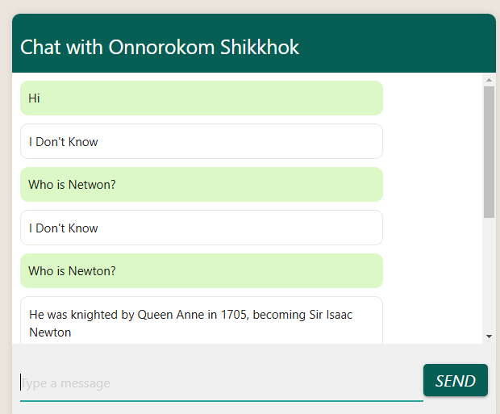
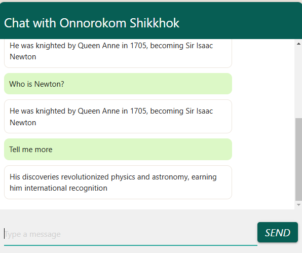

## RAG Application

This project is a Django-based chatbot that uses a vector database for storing and querying text embeddings. It leverages the Ollama API for generating embeddings and the Stanza library for text processing.

## Ollama Setup Instructions

1. Download Ollama from [here](https://ollama.com/).
2. Install Ollama by following the instructions provided on the download page.
3. To pull the Llama 3.2 model, use the following command:
    ```sh
    ollama pull llama3.2
    ```
4. For other models, replace `llama3.2` with the desired model name in the command above.


## Setup Instructions

1. Clone the repository:
    ```sh
    git clone https://github.com/SyedT1/django_chatbot_with_vector_db.git
    ```
2. Navigate to the project directory:
    ```sh
    cd django_chatbot_with_vector_db
    ```
3. Install the required dependencies:
    ```sh
    pip install -r requirements.txt
    ```
4. Set up the database:
    ```sh
    python manage.py migrate
    ```
5. Run the development server:
    ```sh
    python manage.py runserver
    ```
6. Open Powershell as Administrator and run
    ```sh
    ollama serve
    ```
    

## Usage
1. Access the chatbot interface by navigating to `http://127.0.0.1:8000` in your web browser.
2. To upload text files and insert embeddings into the vector database (Chroma DB), navigate to the endpoint `http://127.0.0.1:8000/upload`.
3. The chatbot will respond based on the text embeddings stored in the vector database.


## Supported File Type  
(.txt)


# [Latest] Version-2 (Easy to store, but tough to retrieve) ( EaToR )

## Improvements
1. User gets more accurate responses
2. UI is more developed
3. Persistant storage enabled by chrome_db, hence session-ends won't lose embeddings.


## Limitations
1. Late Responses
2. Responses should include source of the knowledge i.e text file names
3. Include data and time

## Interface




# Version-1 (Easy to store, but tough to retrieve) ( EaToR )


## Todo
- Exception and Error Handling (All modules)
- Memory Optimization
- Minimization of Inference time
- Create diagrammatic representations of the processes.
- Include diagrams in every version to show the state of development.
- Implement fetching queries from the vector database (under development).
- Complete the role of admins in deleting and uploading text files.
    - Ensure embeddings are deleted from the vector database upon file deletion.

## Diagrammatic Processes
- TODO 


## Benchmarks
- TODO
